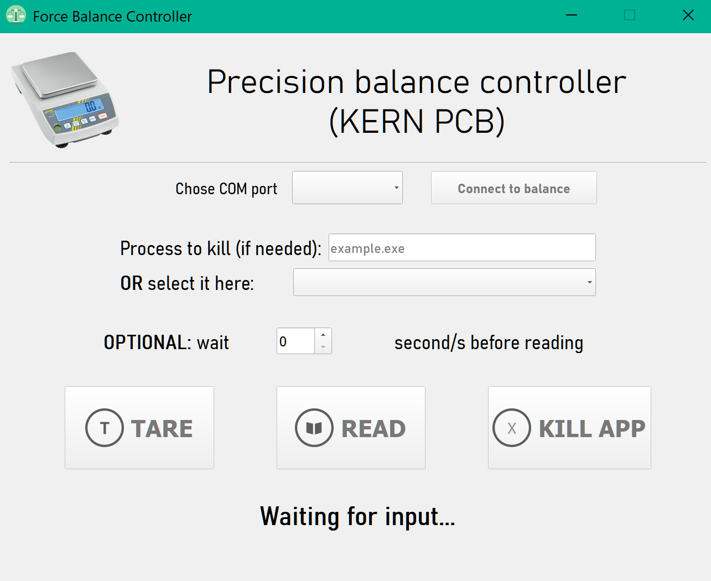

# Force balance controller
A simple python GUI to control the precision scale  
  
This small app allow to control the force balance.  
Windows users can launch the "balance.exe" file to run it.  
Mac users can launch the "balance.py" file to run it. Plase, install the "QtWidgets", "pyserial", and "psutil" libraries.  
  
1. To start you need to select the COM port where the balance is connected to.  
2. Click on the "Connect" button.  
  
TARE = will reset the balance and subtract the current weigth  
  
READ = will provide the first stable reading after having waited for n seconds as choosen in the "wait" box 
  
KILL = it will kill the selected process (as written in the text box or chosen from the dropdown menu)  
  
